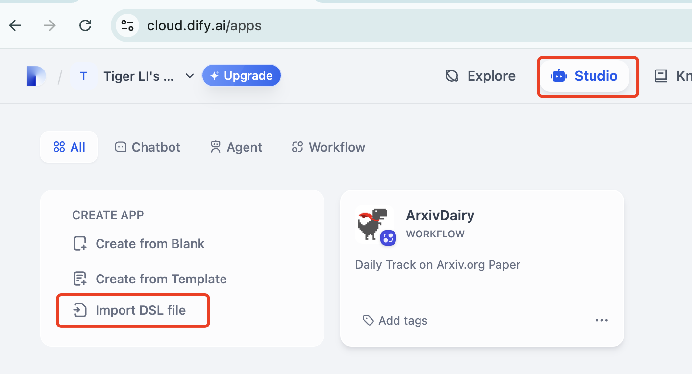
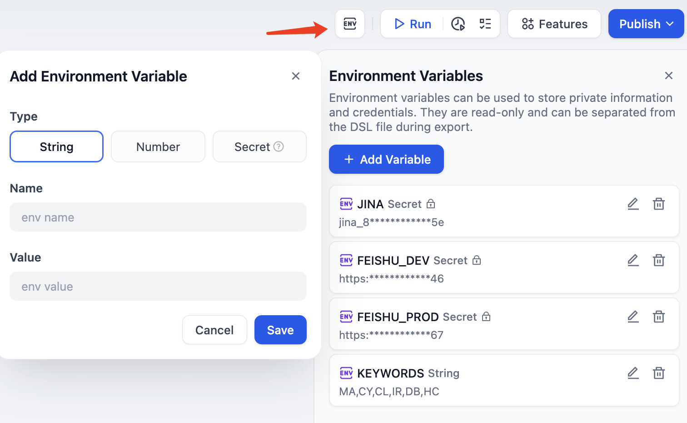

# ArxivFlow
Workflow - Periodic Track on Arxiv.org Paper

# Objectives
This workflow serves for tracking daily updates in Arxiv.org. Paper info will be preprocessed and concluded by a series of modules. Finally, it will post to a group chat in Feishu for reading. The target audience is for education and research community.

# Prerequisites
- A [Dify](https://dify.ai/) account, sign up for free plan.
- A LLM provider API (I use [DeepSeek API](https://platform.deepseek.com/api_keys))
- A [Jina](https://jina.ai/) API key (1M Free credits for new users)
- A [Feishu](https://www.feishu.cn/) webhook (For Feishu group chat robot)

# How to build your own workflow?
1. Open your Dify Cloud and find the "Studio" tab.
2. Create a new workflow via import [this](dsl/ArxivDairy.yml) DSL file
3. Configure the environment variables in the workflow. 
4. Schedule automation: Please refer to this [repo](https://github.com/leochen-g/dify-schedule)

# Env Var Breakdown
- `FEISHU_xxx`: Webhook of Feishu Group Bot testing (_DEV) and Deployment (_PROD)
- `JINA`: web crawler for Arxiv.org（ p.s. Jina tool in Dify Marketplace, can't function well）
- `KEYWORDS`: For Arxiv query, comma separated. I set 6 keywords in align with my pre-defined time-trigger automation flow in Github Actions.

# Cost
For each message, the cost is Deepseek API + Jina API =< 0.05 CNY

# Acknowledgement
