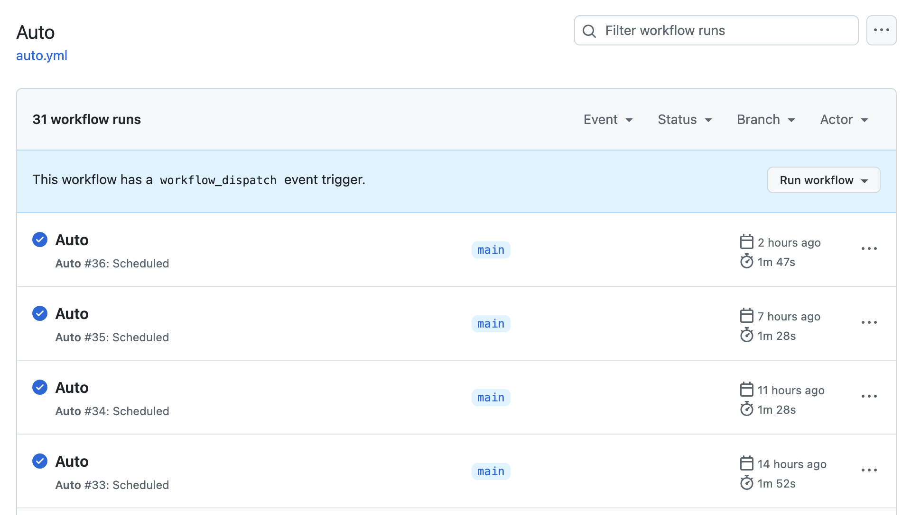

# ArxivFlow
Workflow - Periodic Track on Arxiv.org Paper

Author: Tiger, member from [HKUST Dial](https://github.com/HKUSTDial)

Last update: Mar 06, 2025

# Objectives
This workflow serves for tracking daily updates in Arxiv.org. Paper info will be preprocessed and concluded by a series of modules. Finally, it will post to a group chat in Feishu for reading. The target audience is for education and research community.

> Cost: less than 0.05 CNY per workflow execution.

# Prerequisites
- A [Dify](https://dify.ai/) account, sign up for free plan.
- A LLM provider API (I use [DeepSeek API](https://platform.deepseek.com/api_keys))
- A [Jina](https://jina.ai/) API key (1M Free credits for new users)
- A Group Bot webhook (For Feishu group chat robot)

# How to build your own workflow?
1. Open your Dify Cloud and find the "Studio" tab.
2. Create a new workflow via import [this](dsl/ArxivDairy.yml) DSL file
3. Configure the environment variables in the workflow. 
4. Workflow Execution:
- Manual mode: Click the "Run" button in the workflow page.
- [Advanced] Scheduled mode: Please refer to this [repo](https://github.com/leochen-g/dify-schedule) (I use Github Actions to trigger the workflow, see below for reference) 
5. Final Result: 

# Env Var Breakdown
- `FEISHU_xxx`: Webhook of Feishu Group Bot testing (_DEV) and Deployment (_PROD)
- `JINA`: web crawler for Arxiv.org（ p.s. Jina tool in Dify Marketplace, can't function well）
- `KEYWORDS`: For Arxiv query, comma separated. I set 6 keywords in align with my pre-defined time-trigger automation flow in Github Actions.
- `PAPER_NUM_MAX`: number of papers for message post (you can not send too much information in Feishu)

# Acknowledgement
- Dify Official Guidance: [Link](https://docs.dify.ai/docs/workflow/overview)
- Feishu - How to use Bot in Group Chat: [Link (Chinese)](https://www.feishu.cn/hc/zh-CN/articles/360024984973-%E5%9C%A8%E7%BE%A4%E7%BB%84%E4%B8%AD%E4%BD%BF%E7%94%A8%E6%9C%BA%E5%99%A8%E4%BA%BA?from=in-im-bot)
- AWS Workshop: Lab3-使用Dify构建AI Workflow: [Link (Chinese)](https://catalog.us-east-1.prod.workshops.aws/workshops/2c19fcb1-1f1c-4f52-b759-0ca4d2ae2522/zh-CN)
- Arxiv Category: [Link](https://arxiv.org/category_taxonomy)

