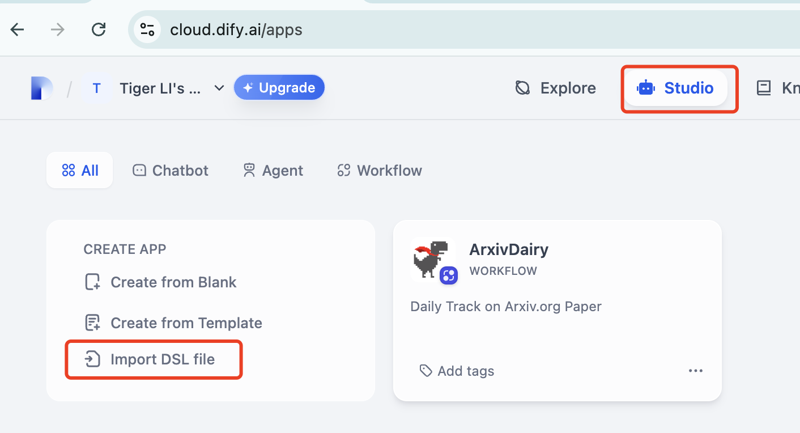
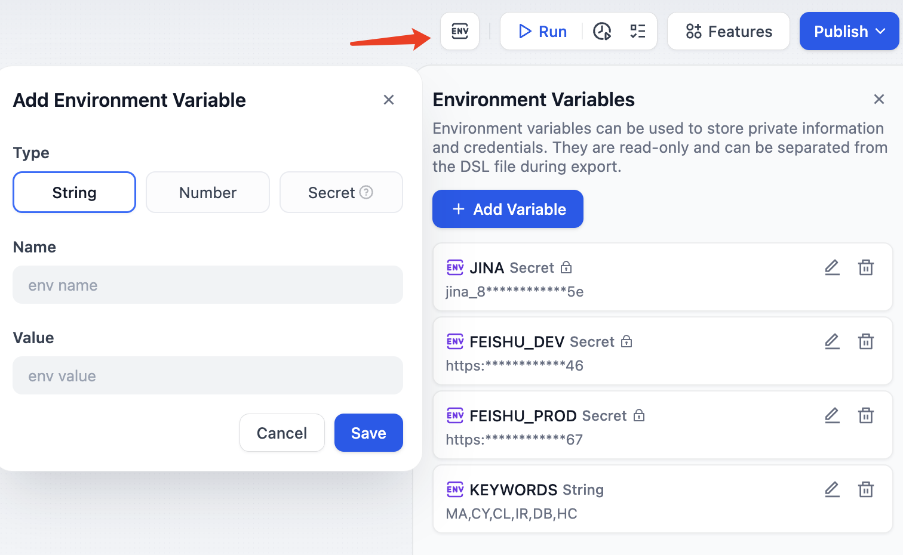
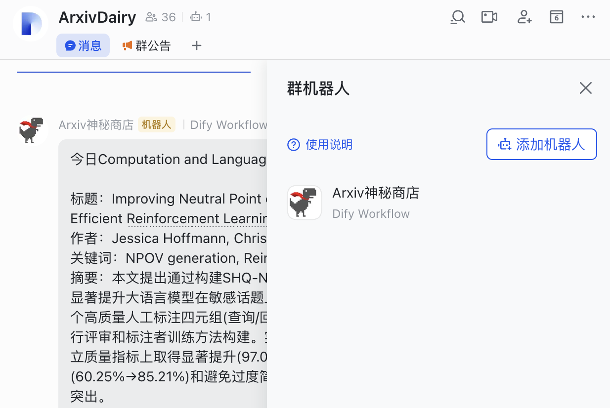

# ArxivFlow - Periodic Track on arXiv Paper

English | [中文](README_CN.md)

Author: Tiger, member from [HKUST Dial](https://github.com/HKUSTDial)

Last update: May 09, 2026

## 🎯 Objectives
This workflow serves for tracking daily updates in arXiv.org. Paper info will be preprocessed and concluded by a series of modules. Finally, it will post to a group chat in Feishu for reading. The target audience is for education and research community.

> 💰 Cost: less than 0.05 CNY per workflow execution.

## ✨ Key Features

- 📚 Automatically fetch latest arXiv papers
- 🤖 DeepSeek-V4-powered paper summarization and filtering
- 📱 Auto-send to Feishu group chat
- ⏰ Dify Cloud internal scheduler trigger
- 🛠️ Local debugging script support

## 📋 Prerequisites

Before getting started, please ensure you have prepared the following accounts and services:

1. **[Dify](https://dify.ai/) account** - Free registration for building AI workflows
2. **Backbone LLM API** - Use the latest [DeepSeek-V4](https://platform.deepseek.com/api_keys) as the workflow backbone LLM
3. **[Jina](https://jina.ai/) API key** - For web content extraction, new users get 1M free credits
4. **Feishu Group Bot Webhook** - For message pushing

## 🚀 Quick Start

### Step 1: Setup Dify Workflow

1. **Open Dify Console**
   - Login to Dify and find the "Studio" tab
   

2. **Import Workflow**
   - Create a new workflow by importing [this DSL file](dsl/ArxivDairy.yml)
   - This DSL file contains the complete logic for paper fetching, processing, and pushing

3. **Configure Environment Variables**
   - Configure necessary environment variables in workflow settings
   
   - See detailed configuration in **Environment Variables Configuration** section below

4. **Configure Scheduler Trigger**
   - Add a scheduler trigger in Dify Workflow Studio
   - Configure the trigger time according to your desired push frequency

### Step 2: Setup Automated Scheduler

Dify Cloud now supports scheduler triggers directly inside Workflow Studio. Use the internal scheduler trigger for automated execution.

#### Quick Setup:

1. **Open Workflow Studio**:
   - Select your imported ArxivFlow workflow in Dify

2. **Add Scheduler Trigger**:
   - Configure the schedule in the workflow trigger settings

3. **Publish Workflow**:
   - Save and publish the workflow so Dify Cloud runs it on schedule

The previous GitHub Actions scheduler has been deprecated and archived under [`deprecated/github-actions-scheduler`](deprecated/github-actions-scheduler/).

### 📱 Final Result



The scheduler will automatically:
- ✅ Execute your Dify workflow daily
- 📊 Log execution results and status
- ❌ Report execution status in Dify
- 🔄 Support workflow-level schedule configuration

## 🔧 Environment Variables Configuration

### Dify Workflow Internal Environment Variables:
- `FEISHU_DEV` / `FEISHU_PROD`: Feishu Group Bot Webhook for testing/production environments
- `JINA`: API key for crawling arXiv search results
- `KEYWORDS`: Keywords for arXiv paper search, comma-separated
  - The number of KEYWORDS and sending frequency should match the Dify scheduler trigger configuration
  - Example: If sending 4 pushes daily, KEYWORDS needs 4 keywords, and timing rules need 4 time points
- `PAPER_NUM_MAX`: Maximum number of papers per message (limited by Feishu message length)

## 🛠️ Debugging Scripts

The `/scripts` folder contains scripts for local debugging and testing, simulating the processes used in Dify Workflow:

- **`jina_extract.py`**: Simulates Jina API calls and paper information extraction logic
- **`sample.text`**: Sample data returned by Jina API for local testing
- **`extracted_papers.json`**: Example of structured paper data after extraction, serves as input for downstream LLM analysis in workflow

These scripts help you test and debug paper extraction logic without consuming API credits.

### Usage for Local Development:
```bash
cd scripts
python jina_extract.py
```

## 🤝 Acknowledgement
- Dify Official Guidance: [Link](https://docs.dify.ai/docs/workflow/overview)
- Feishu - How to use Bot in Group Chat: [Link (Chinese)](https://www.feishu.cn/hc/zh-CN/articles/360024984973-%E5%9C%A8%E7%BE%A4%E7%BB%84%E4%B8%AD%E4%BD%BF%E7%94%A8%E6%9C%BA%E5%99%A8%E4%BA%BA?from=in-im-bot)
- AWS Workshop: Lab3-使用Dify构建AI Workflow: [Link (Chinese)](https://catalog.us-east-1.prod.workshops.aws/workshops/2c19fcb1-1f1c-4f52-b759-0ca4d2ae2522/zh-CN)
- arXiv Category: [Link](https://arxiv.org/category_taxonomy)
- Dify Schedule Project: [Link](https://github.com/leochen-g/dify-schedule) - Inspiration for the deprecated GitHub Actions scheduler implementation

## 📄 License

MIT License - See [LICENSE](LICENSE) file

