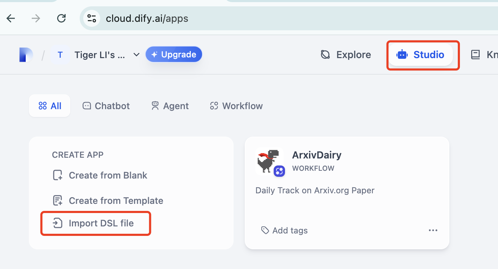
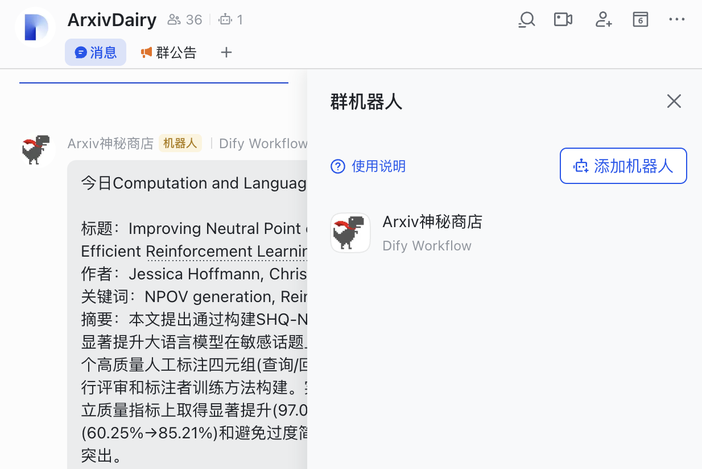

# ArxivFlow - 定期追踪 arXiv论文更新

[English](README.md) | 中文


作者：Tiger，来自 [HKUST Dial](https://github.com/HKUSTDial) 实验室

最后更新：2025年9月9日

## 🎯 项目目标

这个工作流用于追踪 arXiv.org 的日常论文更新。论文信息将通过一系列模块进行预处理和总结，最终发布到飞书群聊中供阅读。目标用户是教育和研究社区成员。

> 💰 成本：每次工作流执行成本低于 0.05 人民币

## ✨ 主要功能

- 📚 自动抓取 arXiv 最新论文
- 🤖 AI 智能总结和筛选论文
- 📱 自动发送到飞书群聊
- ⏰ GitHub Actions 自动定时执行
- 🛠️ 本地调试脚本支持

## 📋 前置条件

在开始之前，请确保您已准备好以下账号和服务：

1. **[Dify](https://dify.ai/) 账号** - 免费注册，用于构建 AI 工作流
2. **LLM 提供商 API** - 推荐使用 [DeepSeek API](https://platform.deepseek.com/api_keys)（性价比高）
3. **[Jina](https://jina.ai/) API 密钥** - 用于网页内容提取，新用户有100万免费额度
4. **飞书群机器人 Webhook** - 用于消息推送

## 🚀 快速开始

### 第1步：设置 Dify 工作流

1. **打开 Dify 控制台**
   - 登录 Dify 并找到 "Studio" 选项卡
   

2. **导入工作流**
   - 创建新工作流，通过导入 [DSL 文件](dsl/ArxivDairy.yml) 
   - 这个 DSL 文件包含了完整的论文抓取、处理和推送逻辑

3. **配置环境变量**
   - 在工作流设置中配置必要的环境变量
   
   - 详细配置说明见下方**环境变量配置**部分

4. **获取 API 令牌**
   - 在工作流设置中获取您的工作流 API 令牌
   - 这个令牌用于后续的自动化调度

### 第2步：设置自动化调度器（推荐）

项目提供一个集成的调度器，可以定时触发DiFy端侧工作流。

#### 快速配置：

1. **配置 GitHub Secrets**：
   - 进入仓库的 Settings > Secrets and variables > Actions > New repository secret
   - 添加密钥`DIFY_TOKENS`: 您的 Dify 工作流 API 令牌（多个令牌用 `;` 分隔）

2. **启用 GitHub Actions**：进入仓库的 Actions 选项卡并启用工作流

3. **自动执行**：调度器将依据 [dify-scheduler.yml](.github/workflows/dify-scheduler.yml) 中的定时规则自动运行，定义语法详见[cron.help](https://cron.help/)。

#### 手动执行：

- **GitHub Actions**：Actions 选项卡 > "Dify ArxivFlow Scheduler" > "Run workflow"
- **本地测试**：
  ```bash
  npm install
  # 设置环境变量
  export DIFY_TOKENS="your_workflow_token_here"
  npm start
  ```

## 🔧 环境变量配置

### GitHub Actions 密钥（必需）：
- `DIFY_TOKENS`: 您的 Dify 工作流 API 令牌，多个工作流用 `;` 分隔

### 可选配置：
- `DIFY_BASE_URL`: Dify API 基础 URL（默认：`https://api.dify.ai/v1`）
- `DIFY_INPUTS`: 工作流输入变量，JSON 格式（默认：`{}`）

### Dify 工作流内部环境变量：
- `FEISHU_DEV` / `FEISHU_PROD`: 飞书群机器人 Webhook，用于测试/生产环境
- `JINA`: 用于arXiv搜索结果的爬取API 密钥
- `KEYWORDS`: 用于arXiv搜索论文关键词，逗号分隔
   - KEYWORDS 数目和时间发送频率需要与GitHub Actions中的定时规则相匹配
   - 例如：每天发送4次推送，那么KEYWORDS需要设置为4个关键词，定时规则也需要有4个时间点
- `PAPER_NUM_MAX`: 每条消息的最大论文数量（受飞书消息长度限制）

## 🛠️ 调试脚本说明

`/scripts` 文件夹包含用于本地调试和测试的脚本，模拟 Dify 工作流中的处理过程：

- **`jina_extract.py`**: 模拟 Jina API 调用和论文信息提取逻辑
- **`sample.text`**: Jina API 返回的示例数据，用于本地测试
- **`extracted_papers.json`**: 提取后的结构化论文数据示例，作为工作流后续大模型LLM分析的输入信息

这些脚本帮助您在不消耗 API 额度的情况下测试和调试论文提取逻辑。

### 本地调试使用方法：
```bash
cd scripts
python jina_extract.py
```

## 📱 最终效果



调度器将自动：
- ✅ 每日执行您的 Dify 工作流
- 📊 记录执行结果和状态
- ❌ 将任何错误报告到 GitHub Actions 日志
- 🔄 根据需要支持多个工作流


## 🤝 致谢

- Dify 官方指南：[链接](https://docs.dify.ai/docs/workflow/overview)
- 飞书 - 如何在群组中使用机器人：[链接](https://www.feishu.cn/hc/zh-CN/articles/360024984973-%E5%9C%A8%E7%BE%A4%E7%BB%84%E4%B8%AD%E4%BD%BF%E7%94%A8%E6%9C%BA%E5%99%A8%E4%BA%BA?from=in-im-bot)
- AWS 工作坊：Lab3-使用Dify构建AI Workflow：[链接](https://catalog.us-east-1.prod.workshops.aws/workshops/2c19fcb1-1f1c-4f52-b759-0ca4d2ae2522/zh-CN)
- arXiv 分类体系：[链接](https://arxiv.org/category_taxonomy)
- Dify 调度项目：[链接](https://github.com/leochen-g/dify-schedule) - 自动化调度器实现的灵感来源

## 📄 许可证

MIT License - 详见 [LICENSE](LICENSE) 文件

